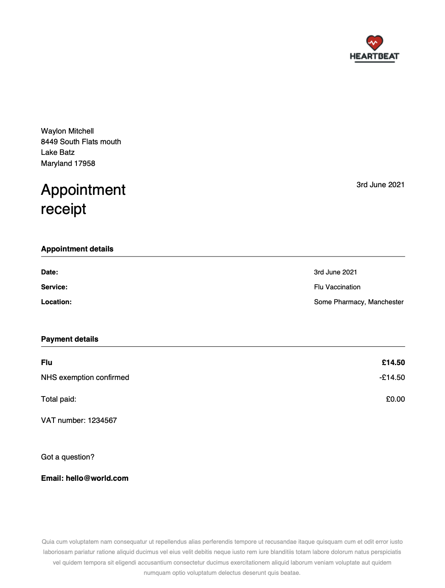

# go-pdf-spike
A spike around generating pdf content using golang

## Getting started

`go run main.go`

## Packages
* [Template](#template)
### Template
This package uses an adapted pattern from the Template design pattern.

The idea is that we have a set of steps we need to perform but the implementation of those steps may be handled by
specific templates how they see fit. E.g. The receipt pdf template may have the logo on the right side whereas the GP
pdf may have a centered logo and some text explaining patient details in a table. - This is typical template pattern.

The adapted part comes from the need for common methods to be reflected in a "Base" class.
E.g. building the footer maybe the same for EVERY template barring one so it makes sense to NOT have to duplicate the same
code for each derived class and instead only the different template can define this method.

Golang doesn't have the normal inheritance support from more mature OOP languages so we attempt to accomplish this
by using composition.

## Generated PDF

